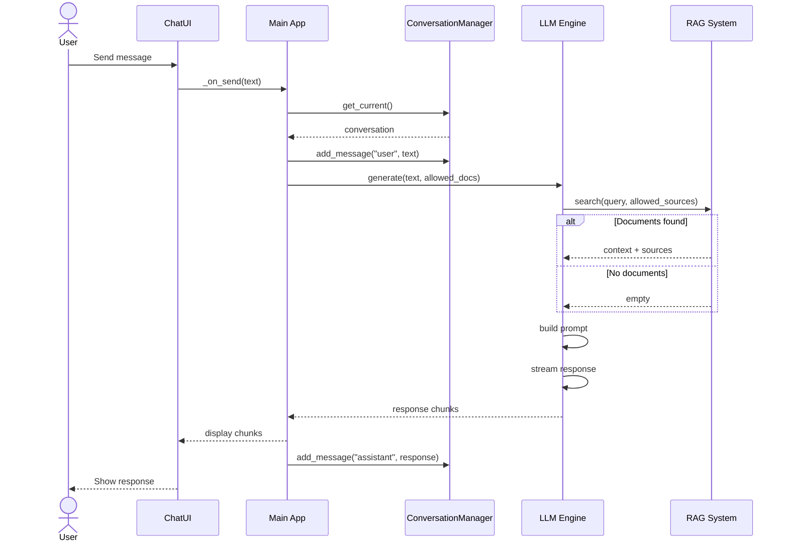
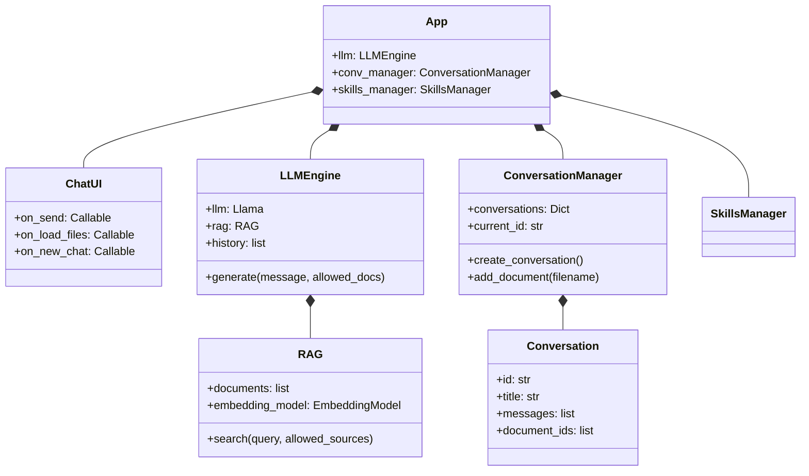
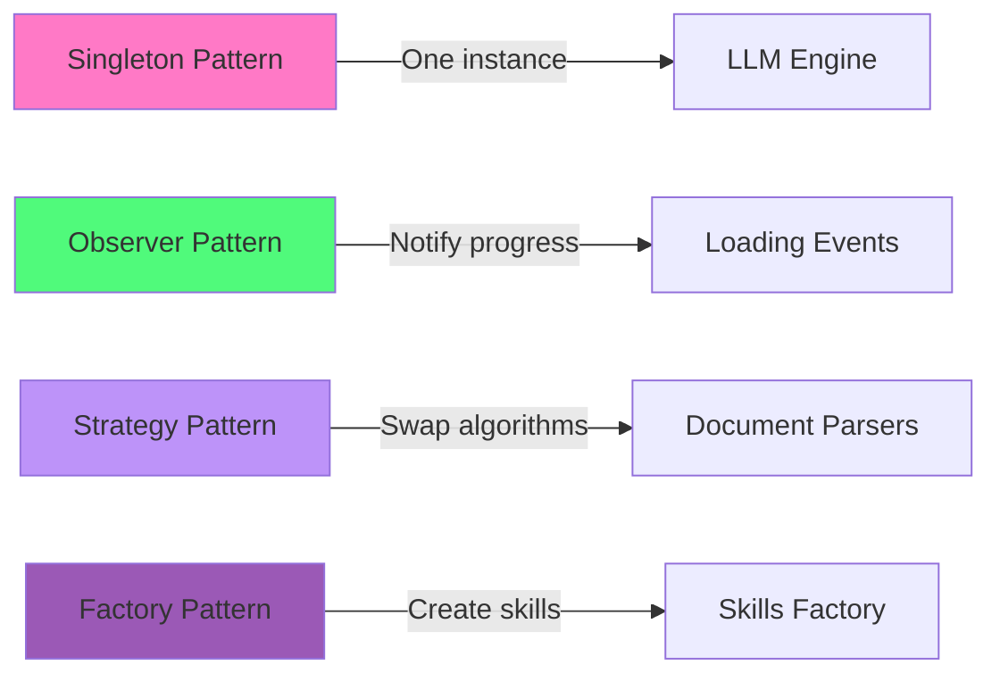

# LocalLLM UI

Chat UI local avec RAG et exécution de code.

## Architecture

```mermaid
graph TB
    subgraph ["Application"]
        App[App]
        UI[UI]
        LLM[LLM Engine]
        RAG[RAG System]
        Skills[Skills Manager]
        Conv[Conversation Manager]
        Code[Code Executor]
    end

    subgraph ["Data"]
        Models[Models]
        Docs[Documents]
    end

    UI -->|"User Message"| LLM
    LLM -->|"Search Context"| RAG
    LLM -->|"Get Current"| Conv
    LLM -->|"Apply Skills"| Skills
    LLM -->|"Execute Code"| Code
    RAG -->|"Index"| Docs
    LLM -->|"Load"| Models

    style App fill:#4a9eff
    style UI fill:#50fa7b
    style LLM fill:#ff79c6
    style RAG fill:#bd93f9
    style Skills fill:#9b59b6
    style Conv fill:#f1fa8c
    style Code fill:#ff5555
```

## Flux de message



## Isolement des conversations

```mermaid
graph LR
    subgraph ["Conversation 1"]
        Conv1[Conversation 1]
        Docs1[doc1.txt, doc2.txt]
    end

    subgraph ["Conversation 2"]
        Conv2[Conversation 2]
        Docs2[doc3.txt]
    end

    subgraph ["RAG Global Index"]
        Index[All Documents Indexed]
    end

    subgraph ["Search Filtering"]
        Filter1[allowed_sources=<br/>["doc1.txt", "doc2.txt"]]
        Filter2[allowed_sources=<br/>["doc3.txt"]]
        Filter3[allowed_sources=[]]
    end

    Docs1 --> Index
    Docs2 --> Index

    Conv1 --> Filter1
    Conv2 --> Filter2
    New[New Conversation] --> Filter3

    Filter1 -->|"Results only from<br/>doc1.txt, doc2.txt"| Index
    Filter2 -->|"Results only from<br/>doc3.txt"| Index
    Filter3 -->|"No results"| Index

    style Conv1 fill:#50fa7b
    style Conv2 fill:#9b59b6
    style New fill:#6272a4
    style Index fill:#f1fa8c
```

## Relations entre classes



## Modules

### Core

| Module | Role |
|--------|------|
| `main` | Entry |
| `ui` | View |
| `llm` | AI |
| `rag` | Docs |

### Data

| Module | Role |
|--------|------|
| `conversations` | Chat |
| `model_manager` | Models |
| `model_catalog` | List |

### Features

| Module | Role |
|--------|------|
| `skills_manager` | Skills |
| `code_executor` | Code |
| `ocr` | Images |

## Patterns



## Install

```bash
pip install -r requirements.txt
python src/main.py
```

## Utilisation

1. **Chat** : Tapez texte
2. **Docs** : Cliquez Load
3. **Models** : Cliquez Models
4. **Skills** : Cliquez Skills
