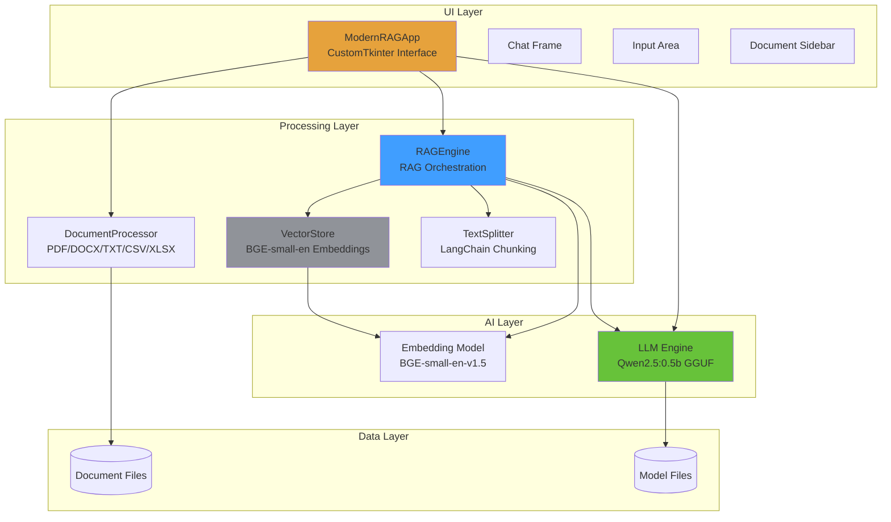
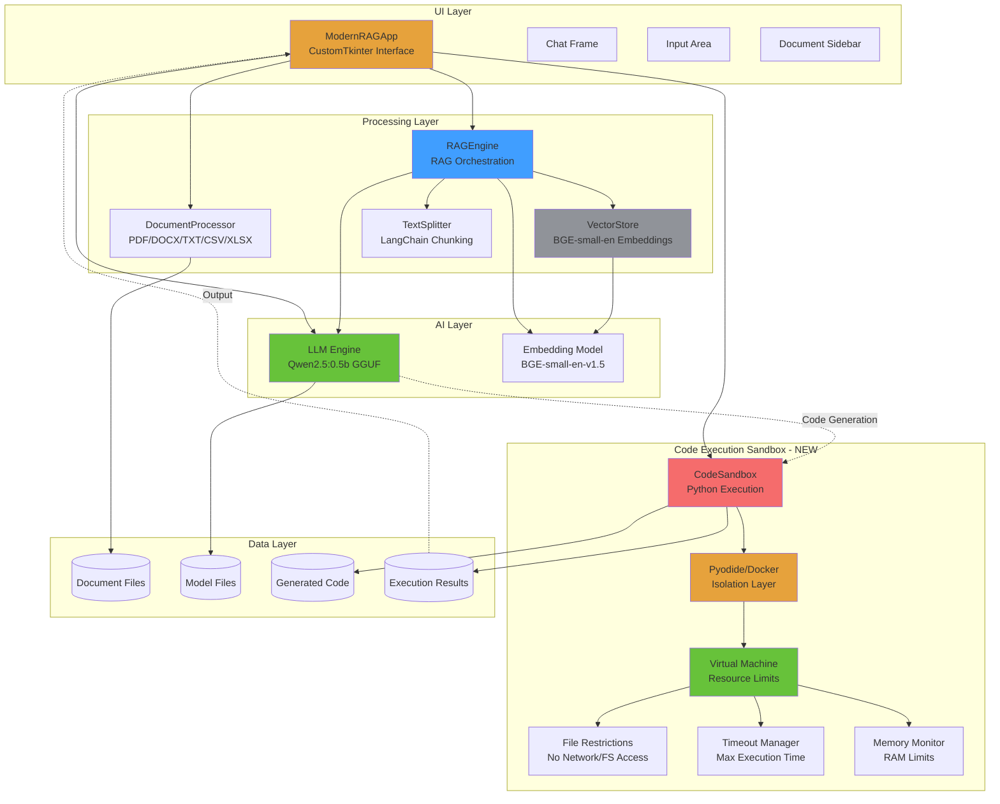
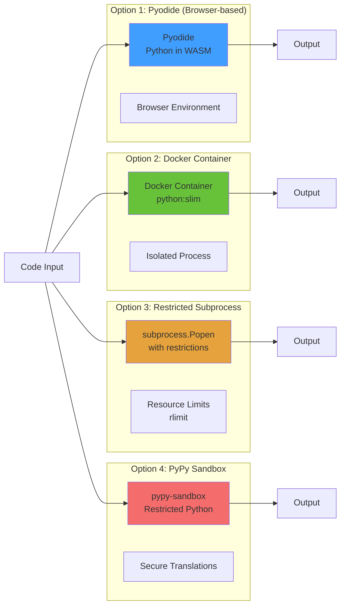
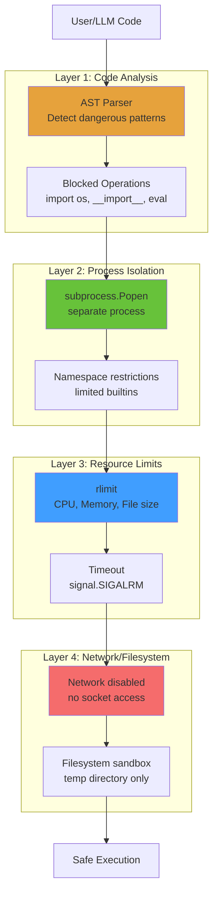
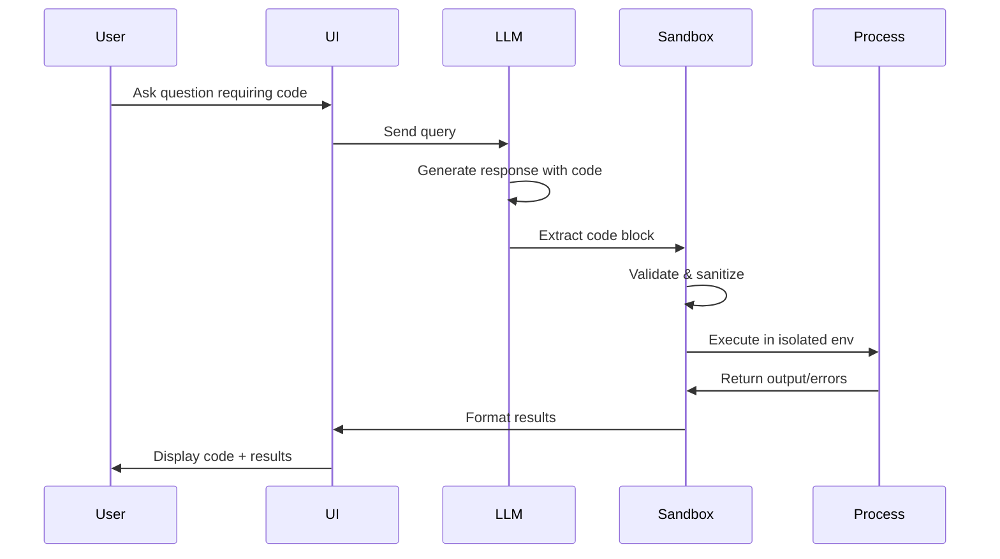
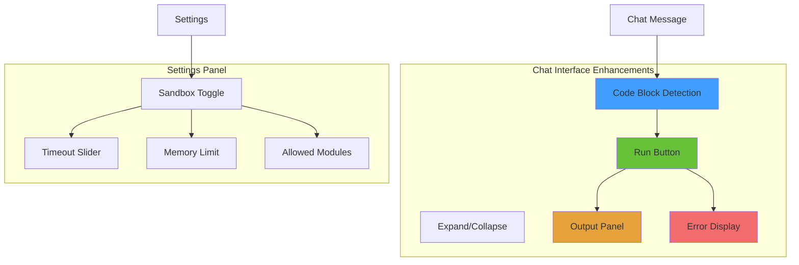

# Local LLM UI - Architecture Overview

## Current Architecture



## Proposed Code Sandbox Integration



## Sandbox Architecture Details

### Integration Points

1. **LLM → Sandbox**: When LLM generates code blocks
   - Detect code blocks in response (```python)
   - Extract code for execution
   - Pass to sandbox with context

2. **Sandbox → UI**: Display execution results
   - Standard output capture
   - Error handling and formatting
   - Result visualization (charts, dataframes)

3. **User → Sandbox**: Direct code execution requests
   - `/run` command in chat
   - Code execution toggle in UI
   - Manual code submission

### Sandbox Implementation Options



### Recommended Architecture: Restricted Subprocess

```python
# Proposed structure: src/sandbox.py

class CodeSandbox:
    """
    Secure code execution sandbox for Python code
    Integrates with LLM to execute generated code
    """

    def __init__(self):
        self.timeout = 30  # seconds
        self.memory_limit = 256  # MB
        self.allowed_modules = [
            'math', 'random', 'datetime', 'json',
            're', 'collections', 'itertools', 'statistics'
        ]
        self.blocked_modules = [
            'os', 'sys', 'subprocess', 'socket',
            'urllib', 'requests', 'pickle', 'shutil'
        ]

    def execute(self, code: str, context: dict = None) -> SandboxResult:
        """
        Execute code in isolated environment

        Args:
            code: Python code to execute
            context: Optional variables to inject

        Returns:
            SandboxResult with output, errors, execution time
        """
        pass

    def execute_with_timeout(self, code: str) -> SandboxResult:
        """Execute with timeout protection"""
        pass

    def sanitize_code(self, code: str) -> str:
        """Remove dangerous operations"""
        pass
```

### Security Layers



### Usage Flow



### Configuration Options

```python
# Add to config.py

# === SANDBOX ===
SANDBOX_ENABLED = True
SANDBOX_TIMEOUT = 30  # seconds
SANDBOX_MEMORY_LIMIT = 256  # MB
SANDBOX_MAX_OUTPUT = 10000  # characters
SANDBOX_ALLOW_NETWORK = False
SANDBOX_ALLOW_FILESYSTEM = False
SANDBOX_TEMP_DIR = "/tmp/localllm_sandbox"
SANDBOX_ALLOWED_MODULES = [
    'math', 'random', 'datetime', 'json',
    're', 'collections', 'statistics'
]
```

### UI Enhancements



## Implementation Priority

1. **Phase 1**: Basic sandbox with subprocess isolation
2. **Phase 2**: Code validation and sanitization
3. **Phase 3**: Resource limits (timeout, memory)
4. **Phase 4**: UI integration (run button, output display)
5. **Phase 5**: Advanced features (visualization, file handling)

## File Structure

```
localllmui/
├── src/
│   ├── main.py          # UI and main app
│   ├── llm.py           # LLM engine
│   ├── sandbox.py       # NEW: Code execution sandbox
│   ├── rag.py           # RAG implementation
│   ├── config.py        # Configuration
│   └── utils.py         # Utilities
├── skills/
│   ├── skill_code.md    # NEW: Code execution skill
│   ├── skill_docx.md
│   ├── skill_pdf.md
│   ├── skill_ocr.md
│   ├── skill_rag.md
│   └── skill_summary.md
└── readme.txt           # This file
```

---

## Getting Started

1. Clone the repository
2. Install dependencies: `pip install -r requirements.txt`
3. Run the app: `python src/main.py`
4. Load documents and ask questions!

## Tech Stack

- **LLM**: Qwen2.5:0.5b (local, quantized)
- **Embeddings**: BGE-small-en-v1.5
- **UI**: CustomTkinter (modern dark theme)
- **RAG**: Custom implementation with LangChain text splitters
- **Sandbox**: Python subprocess with resource limits
